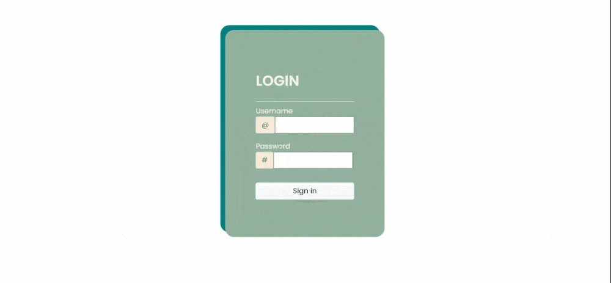

# Plutus

## 💡 Inspiration 💡

Financial literacy amongst teeangers is one of the problems they most encounter when transitioning to adulthood. Interactivity and making these subjects into something engaging helps us reach our target audience and helps teens to get introduced to these concepts.

## ⚙ What it does ⚙

It’s a webapp with two components, the learning activities that helps teens learn financial concepts and the SARIMA-powered expense predictor that helps them manage their finances.

## 🏗 How we built it 🏗

We used Django to structure our webapp and to serve our templates and Scikit-learn to train our SARIMA expense predictor and stored our data in mongodb.
